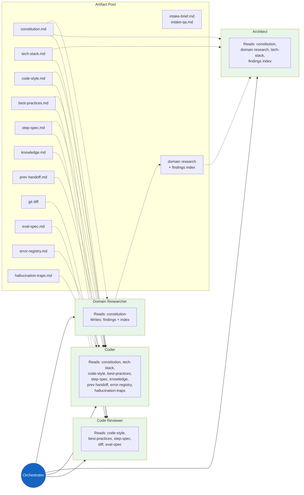

# Context Routing

Every subagent gets a fresh context window with only the files it needs. No agent sees the full picture — each reads a narrow, enforced slice of the artifact tree.

**Key insight:** The Coder never sees raw domain research. The Researcher never sees code-style rules. The Reviewer never sees prior handoffs. This isolation prevents context pollution and keeps each agent focused on its job.
