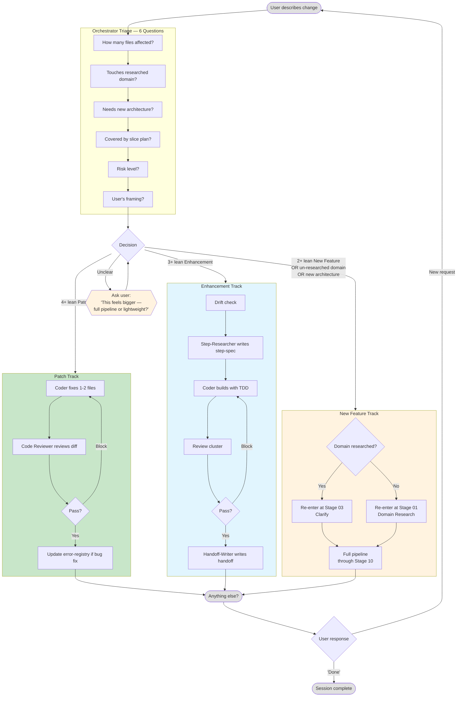

# Iteration Triage

After the feature ships, the orchestrator stays active. Each user request gets triaged into the right track.

```mermaid
flowchart TD
    input([User describes change]) --> q1

    subgraph triage [Orchestrator Triage — 6 Questions]
        direction TB
        q1[How many files affected?] --> q2[Touches researched domain?]
        q2 --> q3[Needs new architecture?]
        q3 --> q4[Covered by slice plan?]
        q4 --> q5[Risk level?]
        q5 --> q6[User's framing?]
    end

    q6 --> decide{Decision}

    decide -->|"4+ lean Patch"| patch
    decide -->|"3+ lean Enhancement"| enhancement
    decide -->|"2+ lean New Feature\nOR un-researched domain\nOR new architecture"| new_feature
    decide -->|"Unclear"| ask{{Ask user:\n'This feels bigger —\nfull pipeline or lightweight?'}}
    ask --> decide

    subgraph patch [Patch Track]
        direction TB
        p1[Coder fixes 1-2 files] --> p2[Code Reviewer reviews diff]
        p2 --> p3{Pass?}
        p3 -->|Yes| p4[Update error-registry if bug fix]
        p3 -->|Block| p1
    end

    subgraph enhancement [Enhancement Track]
        direction TB
        e0[Drift check] --> e1[Step-Researcher writes step-spec]
        e1 --> e2[Coder builds with TDD]
        e2 --> e3[Review cluster]
        e3 --> e4{Pass?}
        e4 -->|Yes| e5[Handoff-Writer writes handoff]
        e4 -->|Block| e2
    end

    subgraph new_feature [New Feature Track]
        direction TB
        n1{Domain researched?}
        n1 -->|Yes| n2[Re-enter at Stage 03\nClarify]
        n1 -->|No| n3[Re-enter at Stage 01\nDomain Research]
        n2 --> n4[Full pipeline\nthrough Stage 10]
        n3 --> n4
    end

    p4 --> loop
    e5 --> loop
    n4 --> loop

    loop([Anything else?]) --> next{User response}
    next -->|New request| input
    next -->|'Done'| fin([Session complete])

    style input fill:#e0e0e0
    style fin fill:#e0e0e0
    style loop fill:#e0e0e0
    style ask fill:#fff3e0
    style patch fill:#c8e6c9
    style enhancement fill:#e1f5fe
    style new_feature fill:#fff3e0
```
