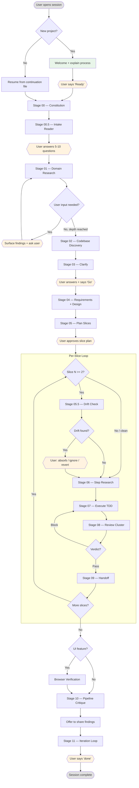

# Pipeline Phases

Full stage flow from first contact to session complete.

```mermaid
flowchart TD
    start([User opens session]) --> welcome{New project?}
    welcome -->|Yes| greet[Welcome + explain process]
    welcome -->|No| resume[Resume from continuation file]

    greet --> ready{{User says 'Ready'}}
    ready --> constitution[Stage 00 — Constitution]
    resume --> constitution

    constitution --> intake[Stage 00.5 — Intake Reader]
    intake --> qa{{User answers 5-10 questions}}
    qa --> research[Stage 01 — Domain Research]

    research --> loop_research{User input needed?}
    loop_research -->|Yes| surface{{Surface findings + ask user}}
    surface --> research
    loop_research -->|No, depth reached| codebase[Stage 02 — Codebase Discovery]

    codebase --> clarify[Stage 03 — Clarify]
    clarify --> go{{User answers + says 'Go'}}
    go --> design[Stage 04 — Requirements + Design]

    design --> plan[Stage 05 — Plan Slices]
    plan --> approve{{User approves slice plan}}

    approve --> slice_loop

    subgraph slice_loop [Per-Slice Loop]
        direction TD
        drift{Slice N >= 2?}
        drift -->|Yes| drift_check[Stage 05.5 — Drift Check]
        drift -->|No / clean| step_research
        drift_check --> drift_result{Drift found?}
        drift_result -->|Yes| user_drift{{User: absorb / ignore / revert}}
        drift_result -->|No| step_research
        user_drift --> step_research

        step_research[Stage 06 — Step Research]
        step_research --> execute[Stage 07 — Execute TDD]
        execute --> review[Stage 08 — Review Cluster]
        review --> verdict{Verdict?}
        verdict -->|Pass| handoff[Stage 09 — Handoff]
        verdict -->|Block| execute
        handoff --> next{More slices?}
        next -->|Yes| drift
    end

    next -->|No| browser{UI feature?}
    browser -->|Yes| verify[Browser Verification]
    browser -->|No| critique
    verify --> critique[Stage 10 — Pipeline Critique]

    critique --> nudge[Offer to share findings]
    nudge --> iteration[Stage 11 — Iteration Loop]
    iteration --> done{{User says 'done'}}
    done --> fin([Session complete])

    style greet fill:#e8f5e9
    style qa fill:#fff3e0
    style go fill:#fff3e0
    style approve fill:#fff3e0
    style ready fill:#fff3e0
    style surface fill:#fff3e0
    style user_drift fill:#fff3e0
    style done fill:#fff3e0
    style fin fill:#e0e0e0
    style start fill:#e0e0e0
```

**Legend:** Orange nodes = human gates. Green = welcome. Grey = start/end.
