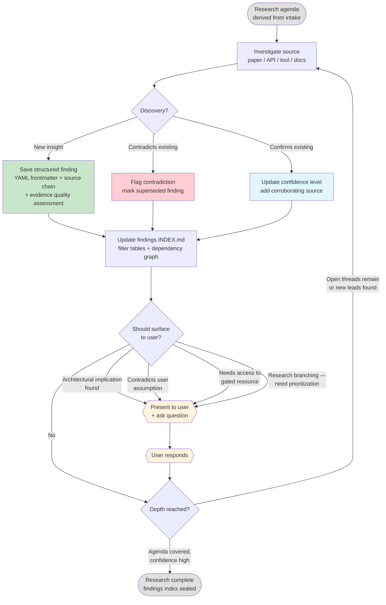

# Research Loop

The iterative domain research cycle. No fixed round limit — the agent keeps digging until depth is reached.

**When to surface to user:**
- Architectural implication discovered (constraints the design)
- Finding contradicts something the user stated
- Gated resource needs user access (subscriptions, internal tools)
- Research is branching — user picks the priority
