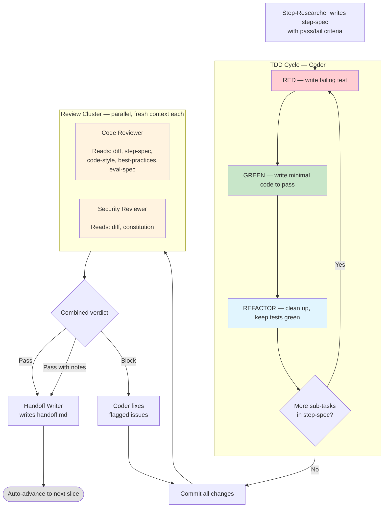

# TDD + Review Cycle

The inner loop for every slice: research, build test-first, review with independent agents, handoff.

```mermaid
flowchart TD
    spec[Step-Researcher writes step-spec\nwith pass/fail criteria] --> red

    subgraph tdd [TDD Cycle — Coder]
        direction TD
        red["RED — write failing test"] --> green["GREEN — write minimal code to pass"]
        green --> refactor["REFACTOR — clean up, keep tests green"]
        refactor --> more{More sub-tasks\nin step-spec?}
        more -->|Yes| red
    end

    more -->|No| commit[Commit all changes]
    commit --> review_cluster

    subgraph review_cluster [Review Cluster — parallel, fresh context each]
        direction LR
        code_review["Code Reviewer\n\nReads: diff, step-spec,\ncode-style, best-practices,\neval-spec"]
        security_review["Security Reviewer\n\nReads: diff, constitution"]
    end

    review_cluster --> merge_verdict{Combined verdict}
    merge_verdict -->|Pass| handoff[Handoff Writer\nwrites handoff.md]
    merge_verdict -->|Pass with notes| handoff
    merge_verdict -->|Block| fix[Coder fixes\nflagged issues]
    fix --> commit

    handoff --> advance([Auto-advance to next slice])

    style red fill:#ffcdd2
    style green fill:#c8e6c9
    style refactor fill:#e1f5fe
    style code_review fill:#fff3e0
    style security_review fill:#fff3e0
    style advance fill:#e0e0e0
```
